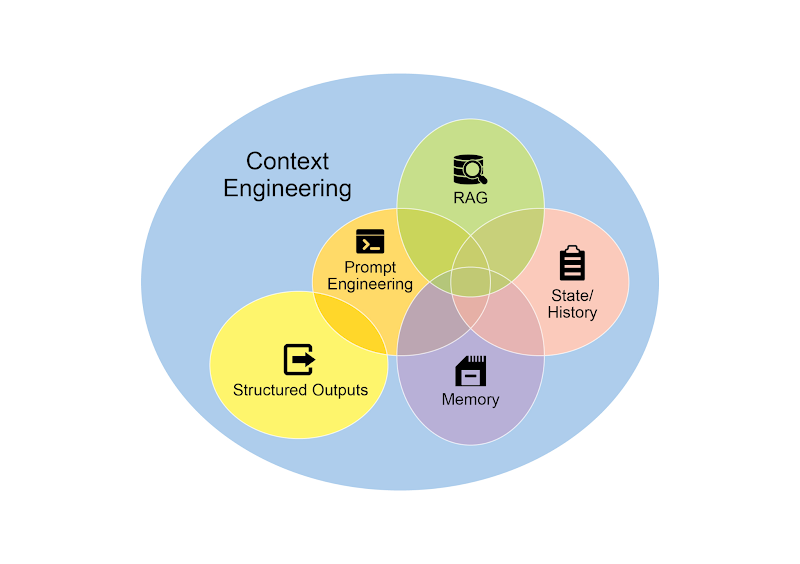
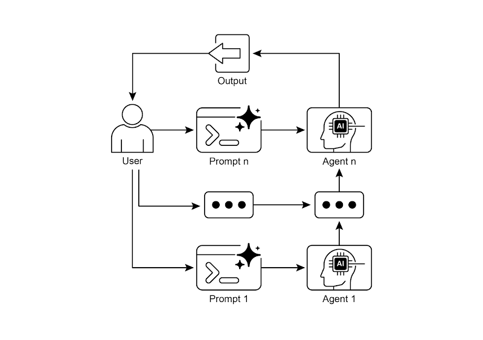

# Agentic 设计模式 - 提示链（Prompt Chaining）

Google 工程师 Antonio Gulli 正在撰写《Agentic Design Patterns》一书，对设计和实现智能代理系统的最佳实践进行了详细的探讨。本文分享对提示链（Prompt Chaining）模式的学习。对于文中使用国外模型的代码示例，我也修改为更适合大家访问的国内大模型，如：deepseek, qwen 等。

**提示链（Prompt Chaining）**，有时也称为 **管道模式（Pipeline Pattern）**，是利用大型语言模型（LLM）处理复杂任务时的一种强大范式。与期望 LLM 通过单一庞杂步骤解决问题不同，提示链提倡采用分而治之的策略。其核心理念是将原始复杂问题分解为一系列更小、更易处理的子问题。每个子问题通过专门设计的提示单独处理，且前一个提示生成的输出会被策略性地作为输入传递给链中的下一个提示。

这种顺序处理技术本质上为与 LLM 的交互引入了模块化和清晰性。通过分解复杂任务，每个独立步骤更易于理解和调试，从而使整体流程更加健壮且可解释。链中的每个步骤都可以精心设计和优化，以专注于更大问题的特定方面，从而产生更准确且聚焦的输出结果。

一个步骤的输出作为下一个步骤的输入至关重要。这种信息传递建立了依赖链（因此得名），其中先前操作的上下文和结果会指导后续处理。这使得 LLM 能够在其前期工作基础上继续构建、完善理解，并逐步接近预期解决方案。

提示链的重要性远不止于简单的问题解决。它作为一种基础技术，为构建复杂的人工智能代理奠定了基础。这些代理能够利用提示链在动态环境中自主规划、推理和行动。通过策略性地构建提示序列，代理可以执行需要多步推理、规划和决策的任务。此类代理工作流能更贴近地模拟人类思维过程，从而在复杂领域和系统中实现更自然、更有效的交互。

## 通过顺序分解可以提升可靠性

提示链技术通过将复杂任务拆解为聚焦的顺序工作流来应对这些挑战，显著提高了可靠性和控制力。以上述案例为例，管道式或链式方法可描述如下：

1. **初始化提示（摘要生成）：**`总结以下市场调研报告中的关键内容：\n\n{text}\n\n摘要：`。该提示仅专注于摘要任务，从而提高这一初始步骤的准确性；
2. **第二级提示（趋势识别）：**`根据摘要内容，识别 3 大新兴趋势，并提取支持每个趋势的具体数据点：\n\n{summary}`。该提示范围更为聚焦，直接基于已验证的输出结果展开；
3. **第三级提示（邮件撰写）：**`根据以下趋势及其支撑数据，为营销团队起草一封简明邮件：\n\n{trends}`。

## 结构化输出

提示链的可靠性高度依赖于步骤之间传递数据的完整性，若某个提示的输出存在歧义或格式不正确，后续提示就可能因输入错误而失败。为此，通常我们会指定输出格式为 JSON 或其他结构化格式，以便后续步骤能够准确解析和利用输出结果。

```json
{
  "trends": [
    {
      "tread_name": "AI 驱动的个性化",
      "supported_data": "73% 的消费者更倾向于与那些利用个人信息来提升购物体验相关性的品牌进行交易。"
    },
    {
      "tread_name": "可持续发展",
      "supported_data": "2023 年，全球可持续发展基金的总金额超过了 1000 亿美元，这标志着可持续发展的重要性日益凸显。"
    }
  ]
}
```

## 实例与应用场景

提示链是一种通用模式，适用于多种代码系统的构建。其核心效用在于将复杂问题分解为可顺序处理的步骤，以下是几种实际应用场景：

1. **信息处理工作流:** 许多任务涉及通过多重转换处理原始信息。例如总结文档、提取关键实体，然后使用这些实体查询数据库或生成报告。提示链可呈现为：
   - Prompt 1: `从给宝 URL 或文档中提取内容`
   - Prompt 2: `总结清理后的文本`
   - Prompt 3: `从摘要或原始文本中提取特定实体（如 '姓名'、'日期'、'地点'）`
   - Prompt 4: `利用这些实体搜索内部知识库`
   - Prompt 5: `生成最终报告，整合摘要、实体及搜索结果`
2. **复杂查询的应答:** 需要进行多步推理或信息检索的复杂问答场景。如：“引发 2008 年的亚洲金融危机的主要原因是什么？政府采取了哪引起主要政策进行应对。”
   - Prompt 1: `识别问题中的关键实体（如 '2008 年'、'亚洲'、'金融危机', '政府', '主要政策'）`
   - Prompt 2: `专门研究或检索关于 2008 年亚洲金融危机的相关信息`
   - Prompt 3: `专门研究或检索有关中国政府应对 2008 年亚洲金融危机的政策的信息`
   - Prompt 4: `将步骤 2 和步骤 3 中的信息综合起来，形成对原始查询的连续回答`
3. **数据提取与转换:** 将非结构化文本转化为结构化格式通常通过迭代过程实现，需要依次进行修改以提高输出的准确性与完整性
   - Prompt 1: `尝试从发票中提取特定字段，如'日期'、'金额'、'客户名称'等`
   - Processing: 对提取到的字段进行验证和清理，确保准确性
   - Prompt 2（条件性）: `若字段缺失或格式错误，则构建新提示要求模型专门查找缺失/格式错误的信息，可提供先前失败尝试的上下文`
   - Processing: 再次验证结果。如有必要，重复之前的操作
   - Output: 提供提取并验证后的结构化数据
4. **内容生成工作流:** 复杂内容的创作是一个流程化任务，通常可分解为明确阶段，包括初步构思、框架搭建、草拟初稿以及后续修订等环节
   - Prompt 1: `根据用户的兴趣生成 5 个主题构想`
   - Processing: 允许用户选择一个想法或自动选择最佳方案
   - Prompt 2: `根据用户选择的主题，生成详细大纲`
   - Prompt 3: `根据大纲第 1 点，撰写初稿章节`
   - Prompt 4: `根据大纲第 2 点撰写初稿章节，并提供前文作为上下文。对所有大纲要点重复此流程`
   - Prompt 5: `审阅并完善，确保连贯性、语气和语法正确`
5. **带状态的对话代理:** 虽然全面的状态管理架构采用了比顺序链接更复杂的方法，但提示链技术为保持对话连续性提供了基础机制。该技术通过将每个对话轮次构建为新的提示，系统性地整合对话序列中先前交互的信息或提取实体，从而维持上下文连贯性
   - Prompt 1: 处理用户话语 1，识别意图和关键实体
   - Processing: 用识别出来的意图和实体更新对话状态
   - Prompt 2: 基于当前状态，生成回复和/或识别下一个需要的信息
   - 对后续轮次重复此过程，每个新的用户对话都会启动一个利用累积对话历史（状态）的链条
6. **代码生成与优化:** 功能性代码的生成通常是一个多阶段过程，需要将问题分解为一系列离散的逻辑操作并逐步执行
   - Prompt 1: 理解用户对代码功能的需求，生成伪代码或功能框架
   - Prompt 2: 根据大纲撰写初始代码草稿
   - Prompt 3: 识别代码中的潜在错误或改进点（可能使用代码静态分析工具或进行另一次 LLM 调用）
   - Prompt 4: 根据发现的问题重写或优化代码
   - Prompt 5: 添加文档注释或测试用例
7. **多模态与多步骤推理:** 分析包含多种模态的数据集需要将问题分解为基于提示的较小任务。例如，解读一张包含嵌入文本的图片、突出特定文本段的标签以及解释每个标签的表格数据时，就需要采用这种方法
   - Prompt 1: 提取并理解用户请求的图像中的文本内容
   - Prompt 2: 将提取的文本与其对应标签关联
   - Prompt 3: 使用表格解析收集的信息以确定需要的输出

## 代码示例

实现提示链技术的方法很多，这里以 [LangChain](https://python.langchain.com/docs/introduction/) 为例。项目使用 [uv](https://docs.astral.sh/uv/getting-started/) 进行管理，初始化项目以后需要添加如下依赖：

```shell
uv add langchain langchain-deepseek
```

打开代码编辑器，输入以下示例代码：

```python
from dotenv import load_dotenv

from langchain_deepseek import ChatDeepSeek
from langchain_core.prompts import ChatPromptTemplate
from langchain_core.output_parsers import StrOutputParser

load_dotenv()  # 从 .env 文件加载环境变量


def main():
  """多步骤提示链示例

  - 提示链将复杂任务分解为一系列较小的、重点明确的步骤。这有时也被称为管道模式。
  - 链中的每个步骤都涉及一个LLM调用或处理逻辑，使用前一步骤的输出作为输入。
  - 这种模式提高了与语言模型进行复杂交互的可靠性和可管理性。
  - 像LangChain/LangGraph和Google ADK这样的框架提供了强大的工具来定义、管理和执行这些多步骤序列。
  """
  # 初始化 llm
  llm = ChatDeepSeek(model='deepseek-chat', temperature=0)

  # Prompt 1: 抽取信息
  prompt_extract = ChatPromptTemplate.from_template('从以下文本中提取技术规格：\n\n{text_input}')

  # Prompt 2: 转换为 JSON
  prompt_transform = ChatPromptTemplate.from_template(
    '将以下规格信息转换为包含"cpu"、"memory"和"storage"键的JSON对象：\n\n{specifications}'
  )

  # 使用 LCEL 构建链
  extraction_chain = prompt_extract | llm | StrOutputParser()
  full_chain = {'specifications': extraction_chain} | prompt_transform | llm | StrOutputParser()

  input_text = '这款新笔记本电脑配备了3.5GHz的8核处理器、16GB内存和1TB NVMe固态硬盘。'

  # 使用输入文本执行链
  final_result = full_chain.invoke({'text_input': input_text})

  print('\n--- 最终 JSON 输出 ---')
  print(final_result)


# 可以直接运行该脚本，使用如下命令
# uv run -m agentic.adp.ch01.multi_step
if __name__ == '__main__':
  main()
```

这段 `Python` 代码演示了如何使用 LangChain 库处理文本。它采用两个独立的提示：一个用于从输入字符串中提取技术规格，另一个将这些规格格式化为 JSON 对象。代码使用 `ChatDeepSeek` 模型进行语言模型交互，并通过 `StrOutputParser` 确保输出为可用的字符串格式。LangChain 表达式语言([`LCEL`](https://python.langchain.com/docs/concepts/lcel/))被用来优雅地将这些提示和语言模型串联起来。第一个链 `extraction_chain` 负责提取规格，`full_chain` 则获取提取结果作为转换提示的输入。示例提供了一个描述笔记本电脑的输入文本，`full_chain` 通过这两个步骤处理该文本后，最终打印出包含提取和格式化规格的 JSON 字符串结果。

在运行代码之前，需要先设置环境变量 `DEEPSEEK_API_KEY`，可以在 [DeepSeek 平台](https://platform.deepseek.cn/) 上获取。将环境变量和密钥写入项目根目录下的 `.env` 文件中，如：

```ini
DEEPSEEK_API_KEY=sk-askdjfwweoiruwofjdsklfasdlfsdf
```

打开终端，输入 `uv run -m agentic.adp.ch01.multi_step` 即可运行代码。运行示例如：

```shell
$ uv run -m agentic.adp.ch01.multi_step

--- 最终 JSON 输出 ---
{
    "cpu": "3.5GHz 8-core",
    "memory": "16GB",
    "storage": "1TB NVMe SSD"
}
```

## 上下文工程与提示工程（Context Engineering and Prompt Engineering）

上下文工程是一门系统性的学科，它关注如何设计和管理上下文，以便在语言模型中获得最佳的性能。该方法论认为，模型输出的质量较少依赖于模型架构本身，而更多取决于所提供上下文的丰富程度！



## 总结

**问题** 对于复杂任务，若只通过单一提示语进行处理，往往会使 LLM 不堪重负，导致严重的性能问题。模型认知负荷的增加会引发多种错误，如遗漏指令、丢失上下文及生成错误信息。整体式提示难以有效管理多重约束与顺序推理步骤，致使输出结果不可靠且不准确——因为 LLM 无法全面处理多层面请求的所有细节。

**原因** 提示链技术通过将复杂问题分解为一系列相互关联的子任务，提供了一种标准化解决方案。链式流程中的每个步骤都使用针对性提示来执行特定操作，显著提升了可靠性与可控性。前序提示的输出会作为后续提示的输入，形成渐进式构建最终解决方案的逻辑工作流。这种模块化的分治策略使流程更易管理、便于调试，并允许在步骤间集成外部工具或结构化数据格式。该模式是开发能够规划、推理和执行复杂工作流的多步骤智能体系统的基础范式。

**经验法则** 当任务过于复杂、涉及多个不同的处理阶段、需要在步骤间与外部工具进行交互时，或构建需要执行多步推理并保持状态的代理系统时，可采用 **_提示链_** 模式。


