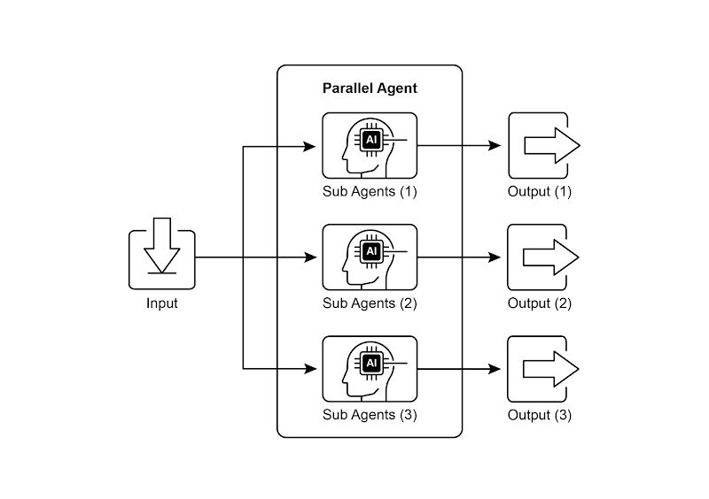

# Agentic 设计模式：并行模式

## 并行化模式概述

对于许多复杂的代理型任务实际上包含多个可以并行执行的子任务，而非必须按顺序完成。在这种情况下，并行化（Parallelization）模式就显得尤为关键。

并行化技术指的是同时执行多个组件，例如大语言模型调用、工具使用，甚至是完整的子代理系统（如图 1 所示）。与传统的等待一个步骤完成后才启动下一个步骤的方式不同，并行执行允许各项独立任务同时运行，从而显著缩短了那些可分解为独立部分的任务的整体执行时间。

以一个研究主题并总结发现的智能代理为例，采用顺序方法的执行流程可能是：

1. 搜索资料来源 A。
2. 总结资料来源 A 的内容。
3. 搜索资料来源 B。
4. 总结资料来源 B 的内容。
5. 基于 A 和 B 的摘要整合出最终答案。

而采用并行方法则可以优化为：

1. 同时搜索资料来源 A 和资料来源 B。
2. 两项搜索都完成后，并行总结资料来源 A 和资料来源 B 的内容。
3. 基于 A 和 B 的摘要整合出最终答案（此步骤通常需要顺序执行，需等待前面的并行步骤全部完成）。

这种模式的核心在于识别工作流中那些不依赖于其他部分输出的环节，并将它们安排为并行执行。当处理具有响应延迟的外部服务（如 API 接口或数据库查询）时，这种方法尤为有效，因为你可以同时发起多个请求而无需逐个等待。

要实现并行化，通常需要借助支持异步操作或多线程/多进程处理的框架。现代代理框架在设计时已经充分考虑了异步执行的需求，使开发者能够便捷地定义和部署可并行运行的任务步骤。



诸如 LangChain、LangGraph 及 Rig 等框架均提供了并行执行机制。在 LangChain 表达式语言（LCEL）中，可通过使用|（顺序执行）等操作符组合可运行对象，或构建具有并发执行分支的链式/图式结构来实现并行化。LangGraph 凭借其图结构特性，允许从单次状态转换触发多个节点执行，从而在工作流中有效创建并行分支。Rig 则内置了强大的原生机制，可高效协调管理代理的并行执行，显著提升复杂多代理系统的效率与可扩展性。该框架的固有特性使开发者能够设计出多代理并发运行的解决方案，而非传统顺序执行模式。

并行化模式对提升代理系统的效率与响应速度至关重要，尤其在处理涉及多源独立查询、计算或外部服务交互的任务时表现突出。这是优化复杂代理工作流性能的核心技术手段。

## 实际应用场景

并行化模式在各类应用中均能有效优化代理性能：

1. **信息采集与研究**：并行从多源获取信息，如新闻、社交媒体、数据库等。
   - **用例**：企业调研代理
     - **并行任务**：同步检索新闻报道、获取股票数据、监测社交媒体提及、查询企业数据库
     - **优势**：显著加快信息整合速度，远超顺序查询效率
2. **数据处理与分析**：并行应用多种分析技术或处理不同数据片段。
   - **用例**：客户反馈分析代理
     - **并行任务**：对批量反馈同步执行情感分析、关键词提取、分类归档及紧急问题识别
     - **优势**：快速生成多维度分析结果
3. **多 API/工具交互**：调用多个独立 API 或工具以获取异构信息或执行不同操作。
   - **用例**：旅行规划代理
     - **并行任务**：同步查询航班价格、酒店空房、本地活动及餐厅推荐
     - **优势**：极速生成完整旅行方案
4. **多组件内容生成**：并行生成复杂内容的不同组成部分。
   - **用例**：营销邮件创作代理
     - **并行任务**：同步生成邮件标题、正文草稿、匹配图片及行动号召按钮文案
     - **优势**：高效组装完整邮件素材
5. **验证与校验**：并行执行多项独立检查或验证。
   - **用例**：用户输入验证代理
     - **并行任务**：同步校验邮箱格式、电话号码有效性、地址数据库匹配及敏感词筛查
     - **优势**：即时反馈输入有效性，提升用户体验
6. **多模态处理**：并行处理同一输入的不同模态（文本/图像/音频）。
   - **用例**：图文社交媒体分析代理
     - **并行任务**：同步执行文本情感分析与关键词提取，及图像物体识别与场景描述
     - **优势**：快速融合跨模态洞察
7. **A/B 测试或多方案生成**：并行生成多种响应变体以择优选取。
   - **用例**：创意文案生成代理
     - **并行任务**：基于微调提示词或模型同步生成三种文章标题方案
     - **优势**：支持快速比对优选最优方案

作为代理设计中的基础优化技术，并行化通过并发执行独立任务，使开发者能够构建出性能更卓越、响应更迅速的应用系统。

## 代码示例（LangChain 框架）

在 LangChain 框架中，并行执行功能通过**LangChain 表达式语言（LCEL）**实现。其核心机制在于：将多个可运行组件封装于字典或列表结构中。当该集合作为输入传递给链式结构的后续组件时，LCEL 运行时将自动并发执行其中的所有可运行单元。

在 LangGraph 框架下，该原理被应用于图拓扑结构的构建。具体实现方式为：设计图结构时，使多个不存在直接顺序依赖关系的节点能够从同一公共节点触发。这些并行路径独立执行后，其结果将在图结构中后续的汇聚点进行整合。

以下实现方案展示了基于 LangChain 框架构建的并行处理工作流。该工作流针对单一用户查询，设计了两条独立操作链路同步执行。这些并行进程被实例化为独立的链或函数，其输出结果最终将聚合为统一响应。

实现前提条件：

- 安装必要的 `Python` 依赖包，包括 `langchain`、`langchain-community` 以及模型提供商库（如 `langchain-deepseek`）
- 在本地环境配置所选语言模型的有效 API 密钥，完成身份验证设置

```python
import asyncio
from dotenv import load_dotenv

from langchain_deepseek import ChatDeepSeek
from langchain_core.prompts import ChatPromptTemplate
from langchain_core.output_parsers import StrOutputParser
from langchain_core.runnables import Runnable, RunnableParallel, RunnablePassthrough

load_dotenv()

# 确保已设置您的 API 密钥环境变量（例如：DEEPSEEK_API_KEY）
llm = ChatDeepSeek(model='deepseek-chat', temperature=0.7)

# --- 定义独立链 ---
# 这三个链代表可以并行执行的不同任务。
summarize_chain: Runnable = (
  ChatPromptTemplate.from_messages([('system', '请简洁地总结以下主题：'), ('user', '{topic}')])
  | llm
  | StrOutputParser()
)

questions_chain: Runnable = (
  ChatPromptTemplate.from_messages([('system', '针对以下主题生成三个有趣的问题：'), ('user', '{topic}')])
  | llm
  | StrOutputParser()
)

terms_chain: Runnable = (
  ChatPromptTemplate.from_messages([('system', '从以下主题中识别5-10个关键术语，用逗号分隔：'), ('user', '{topic}')])
  | llm
  | StrOutputParser()
)

# --- 构建并行 + 合成链 ---

# 1. 定义要并行运行的任务块。这些任务的结果，以及原始主题，将被 feed 到下一步。
map_chain = RunnableParallel(
  {
    'summary': summarize_chain,
    'questions': questions_chain,
    'key_terms': terms_chain,
    'topic': RunnablePassthrough(),  # Pass the original topic through
  }
)

# 2. 定义最终合成提示，将并行结果组合起来。
synthesis_prompt = ChatPromptTemplate.from_messages(
  [
    (
      'system',
      """根据以下信息：

    摘要：{summary}

    相关问题：{questions}

    关键术语：{key_terms}

    综合回答。""",
    ),
    ('user', '原始主题：{topic}'),
  ]
)


# 3. 构建完整链，将并行结果直接管道到合成提示，后面是 LLM 和输出解析器。
full_parallel_chain = map_chain | synthesis_prompt | llm | StrOutputParser()


# --- 运行链 ---
async def run_parallel_example(topic: str) -> None:
  """异步调用并行处理链处理指定主题并打印合成结果。

  Args:
    topic: 将被LangChain链处理的输入主题。
  """
  print(f"\n--- 异步调用并行处理链处理主题: '{topic}' ---")

  try:
    # 传递给 `ainvoke` 的输入是单个 'topic' 字符串，
    # 然后传递给 `map_chain` 中的每个可运行组件。
    response = await full_parallel_chain.ainvoke(topic)
    print('\n--- 并行处理链合成结果 ---')
    print(response)
  except Exception as e:
    print(f'\n执行链过程中发生错误：{e}')


# uv run -m agentic.adp.ch03.parallelization-langchain
if __name__ == '__main__':
  test_topic = '空间探索的历史'
  asyncio.run(run_parallel_example(test_topic))
```

本段代码实现了一个基于 `LangChain` 的应用程序，旨在通过并行执行机制高效处理指定主题。**需特别说明：** `asyncio` 提供的是**并发**而非真正并行——其通过单线程事件循环在任务空闲（如等待网络请求）时智能切换，营造多任务同时推进的效果。但代码实际仍受 `Python` 全局解释器锁（GIL）限制，仅由单线程执行。

代码首先从 `langchain_deepseek` 和 `langchain_core` 导入核心模块，涵盖语言模型、提示模板、输出解析器及可运行结构等组件。通过 `try-except` 块鲁棒性地初始化 `ChatDeepSeek` 实例，指定使用 `deepseek-chat` 模型并设置温度参数控制创造性输出。随后定义**三条独立链式结构**，分别执行不同任务：

1. **摘要链：** 使用定制化系统提示与用户提示（含主题占位符）生成精简摘要
2. **问题链：** 针对主题生成三个关联性提问
3. **关键词链：** 提取 5-10 个核心术语并以逗号分隔输出

每条独立链均由**任务专属的 `ChatPromptTemplate`**、初始化语言模型及 `StrOutputParser`（字符串格式化输出）构成。

通过构建 `RunnableParallel` 块将三条链捆绑，实现同步执行。该并行块还包含 `RunnablePassthrough` 组件，确保原始主题输入可供后续步骤调用。另设独立 `ChatPromptTemplate` 用于最终合成步骤，接收摘要、问题、关键词及原始主题作为输入，生成综合答案。端到端处理链 `full_parallel_chain` 通过串联 `map_chain`（并行块）、合成提示、语言模型及输出解析器完成构建。

异步函数 `run_parallel_example` 演示了调用流程：接收主题输入后通过 `invoke` 执行异步链。标准 `Python` 入口块 `if __name__ == '__main__':` 展示如何以"太空探索历史"为示例主题，通过 asyncio.run 管理异步执行。

**核心机制：** 该代码为给定主题同步触发多路 LLM 调用（摘要/问题/关键词），最终通过单次 LLM 调用整合结果，充分展现了 LangChain 框架下代理工作流的并行化核心思想。

## 一目了然

**核心问题：** 代理工作流通常需完成多项子任务才能达成最终目标。若采用顺序执行模式——即每个任务需等待前序任务完成——将导致效率低下且响应迟缓。当任务涉及外部 I/O 操作（如调用多个 API 或查询不同数据库）时，这种延迟会成为显著瓶颈。若缺乏并发执行机制，总处理时间将等于各任务时长的简单叠加，严重阻碍系统整体性能与响应速度。

**解决方案：** 并行化模式通过实现独立任务的同步执行，提供标准化解决路径。其核心机制在于识别工作流中互不依赖的组件（如工具调用或大语言模型请求），这些组件无需等待彼此的即时输出。LangChain 与 Google ADK 等代理框架内置专用结构，用于定义和管理此类并发操作。例如，主进程可触发多个并行运行的子任务，待全部完成后才进入下一阶段。通过将独立任务同步执行而非顺序处理，该模式能显著降低总执行耗时。

**经验法则：** 当工作流包含可同步运行的独立操作时，应采用此模式。典型场景包括：从多个 API 获取数据、并行处理不同数据片段、或为后续合成生成多份内容素材。

## 总结

并行化模式作为计算工作流优化方法论，通过同步执行独立子任务实现性能突破。该机制在涉及多模型推理或外部服务调用的复杂操作中，能显著降低端到端延迟。

主流框架提供差异化实现路径：

- **LangChain：** 通过 `RunnableParallel` 等组件显式定义多处理链同步执行

将并行处理与顺序链式（chaining）、条件路由（routing）等控制流有机融合，可构建具备高性能特征的计算系统，实现多样化复杂任务的高效管理。这种混合架构为现代智能代理系统提供了性能与灵活性的双重保障。

### 关键结论：

- **并行化模式：** 通过同步执行独立任务提升系统效率的核心设计范式
- **适用场景：** 任务涉及外部资源等待（如 API 调用）时效果尤为显著
- **架构代价：** 并发/并行架构将显著增加系统复杂度与开发成本，影响设计、调试及日志管理等关键环节
- **框架支持：** `LangChain` 等主流框架均内置并行执行机制
- **LCEL 实现：** 通过 `RunnableParallel` 组件实现多任务并行运行
- **核心价值：** 有效降低系统延迟，显著提升复杂任务场景下代理系统的响应速度
